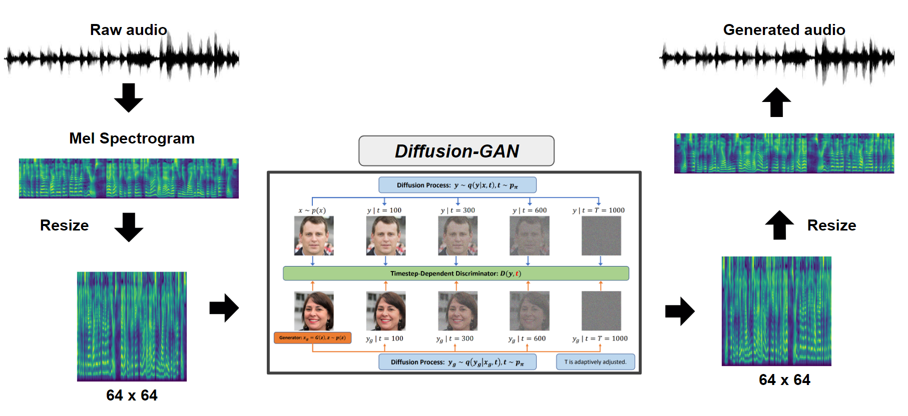

# CS570 Artificial Intelligence and Machine Learning
Repository for Group Project of CS570, KAIST, 2023 Spring

### Collaborator
> Sorted by Korean alphabetical order
* [Hyeongseok Gwak](https://github.com/khs5696)
* [Seongho Keum](https://github.com/Seongho18)
* [Suhwan Sung](https://github.com/yominx)
* [Sungwoo Jeon](https://github.com/marunero)

## About the Course

> Please refer to the [syllabus](https://cais.kaist.ac.kr/syllabusInfo?year=2023&term=1&subject_no=36.570&lecture_class=&dept_id=4421)

## About the Project

>  **Diffusion-GAN Model for Audio Synthesis**


### Overview of architecture



### Demo
Our Diffusion-GAN melspectrogram result (100 samples) is in diffgan_output.zip. You can convert each melspectrogram .png file into .wav

## About the Code

### Pre-processing
Use wav2mel.py to convert from audio.wav into mel.png
```bash
$ python wav2mel.py --input audio.wav --save mel.png
```

### Training
We utilized the publicly accessible source code of [Diffwave](https://github.com/lmnt-com/diffwave) and [Diffusion-GAN](https://github.com/Zhendong-Wang/Diffusion-GAN) for our project

Our experimental setup is described in our report. 

### Convert Mel-spectrogram to audio
Use mel2wav.py to convert from mel.png into output.wav
```bash
$ python mel2wav.py --input mel.png --save output.wav
```

